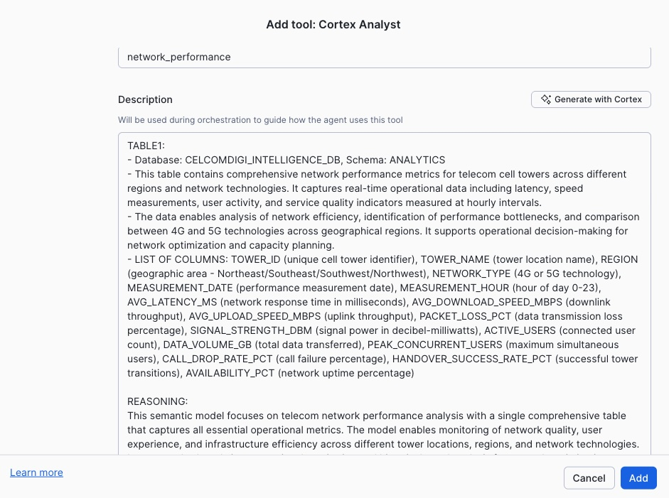
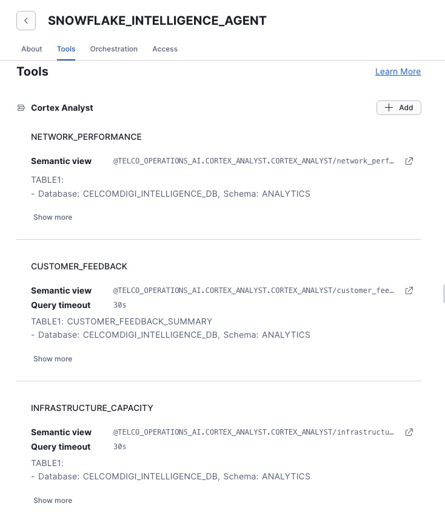

# <h1black>Create </h1black><h1blue>Cortex Agents</h1blue>

Cortex Agents combine semantic models and search services into an intelligent conversational AI that can answer complex business questions.

---

## <h1black>🤖 Step 7: Create Cortex Agent </h1black><h1blue>(5 minutes)</h1blue>

### <h1sub>Verify Your Context</h1sub>

Before creating the agent, ensure you have the correct role set:

1. **Role**: Use **ACCOUNTADMIN** (check top-left corner)

You can verify by running:
```sql
USE ROLE ACCOUNTADMIN;
USE DATABASE TELCO_OPERATIONS_AI;
```

**Note**: The semantic models are in the `CORTEX_ANALYST` schema, but they reference tables in `DEFAULT_SCHEMA`.

### <h1sub>Navigate to Agents</h1sub>

1. Click **AI & ML** in the left navigation
2. Click **Agents**
3. Click **+ Create Agent** button (top right)


### <h1sub>Configure the Agent</h1sub>

**Basic Information:**
- **Name**: `TELCO_INTELLIGENCE_AGENT`
- **Description**: `Intelligence agent for telco operations - combines semantic models and search for comprehensive analysis`
- **Schema**: Select `TELCO_OPERATIONS_AI.CORTEX_ANALYST` from the dropdown (⚠️ **Important**: This is where the semantic models are located)
- **Warehouse**: Select `CITYFIBRE_DEMO_WH`
- **Timeout**: `60` seconds

After pressing Create Agent, you will be asked to populate the description.  This will give an overview for the users as they as they select the agent within Snowflake Intelligence.

In addition, in the top right hand corner of the screen is an icon, this is where you can select from a list of icons along with the colour.  In this instance, we have selected an orange icon with a lightning image.


As you configure the agent, press the save button to ensure you do not lose your changes.  you will see the save button on the top right hand corner of the screen.


**Add Tools (Semantic Models):**

Click **+ Add Tool** and add all 3 semantic models from the `CORTEX_ANALYST` schema.  Within the schema there is a stage called **Cortex Analyst** which is where you will see 3 yaml files:


1. `network_performance` - Network and infrastructure analytics
2. `infrastructure_capacity` - Capacity planning insights
3. `customer_feedback` - Customer sentiment analysis

As you create each tool you cna use the 'Generate with Cortex' to describe each tool.



Keep the default for users warehouse and select 30 seconds for Query Timeout

Repeat the same process for each semantic model.

You should now have three tools which all allow intelligent querying across 3 semantic models.



Save your work.  Now we will give the agent the ability to search through unstructured data via the previously created search service.


**Add Tools (Cortex Search Services):**

Click **+ Add Tool** and add both search services:
1. `CALL_TRANSCRIPT_SEARCH` - Semantic search across call transcripts
2. `SUPPORT_TICKET_SEARCH` - Semantic search across support tickets

Each service was created within the DEFAULT_SCHEMA.  


You will note that there is an ID column and title column - this is for linking to unstructured documents such as PDFs and sound files.


Click on the **Orchestration button** - this allows you to give rules to the agent on how to answer the questions and what sort of reponse they should expect.

**Important Notes:**
- ✅ **Role**: Ensure you're using **ACCOUNTADMIN** which has access to both schemas
- ✅ **Semantic Models**: Located in `TELCO_OPERATIONS_AI.CORTEX_ANALYST` schema
- ✅ **Search Services**: Located in `TELCO_OPERATIONS_AI.DEFAULT_SCHEMA` schema
- ✅ **Data Tables**: Located in `TELCO_OPERATIONS_AI.DEFAULT_SCHEMA` (referenced by semantic models)

### <h1sub>Test Your Agent</h1sub>


Under the Save button, you will see a test interface which is used to test sample questions.  Try and test using a selection of questions from below.

**Network Operations:**
- "Which regions have the highest network latency issues?"
- "Show me 5G towers operating above 80% capacity"
- "Find calls mentioning network connectivity problems"

**Customer Experience:**
- "What are the top 3 customer complaints this month?"
- "Find support tickets about billing issues"
- "Which customer segments have the highest churn risk?"

**Combined Intelligence:**
- "Are network issues correlated with negative customer sentiment?"
- "Show me regions with both high latency and customer complaints"
- "What percentage of calls mention competitor names?"

Return back to the first tab (The About Tab)

add a few Example Questions in the Example questions area.


### <h1sub>What Makes Agents Powerful</h1sub>

- **Multi-source intelligence** - Queries across semantic models AND search services
- **Contextual understanding** - Maintains conversation history
- **Automatic routing** - Agent decides which tools to use
- **Natural language** - No SQL knowledge required

### <h1sub>Understanding Agent Architecture</h1sub>

Your Cortex Agent acts as an intelligent orchestrator:

1. **Receives Questions** - Accepts natural language queries from users
2. **Analyzes Intent** - Determines what type of information is needed
3. **Selects Tools** - Chooses the appropriate semantic model(s) or search service(s)
4. **Executes Queries** - Runs queries against selected data sources
5. **Synthesizes Results** - Combines information from multiple sources if needed
6. **Returns Answers** - Provides comprehensive responses in natural language

**Example Flow:**

Question: *"Are network issues correlated with negative customer sentiment?"*

1. Agent identifies this requires **both** structured and unstructured data
2. Queries `network_performance` semantic model for infrastructure issues
3. Searches `CALL_TRANSCRIPT_SEARCH` for sentiment patterns
4. Correlates results based on geography or time period
5. Provides an integrated answer with insights from both sources

---


**Next:** Use your Cortex Agent in Snowflake Intelligence to explore conversational analytics.