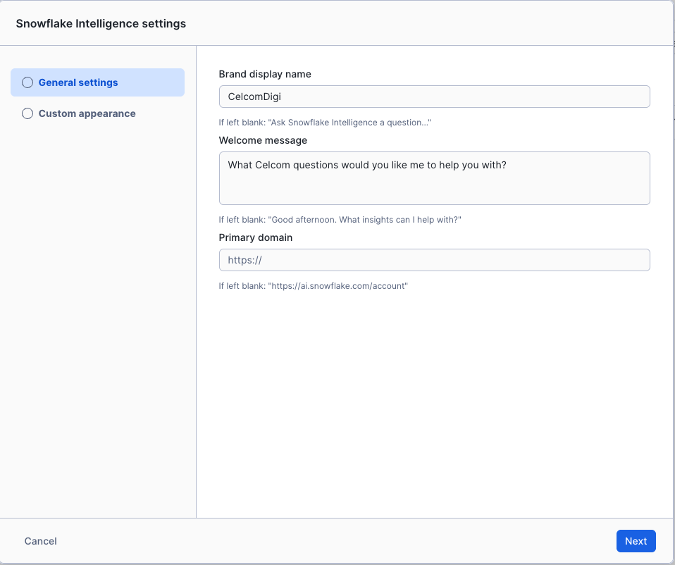
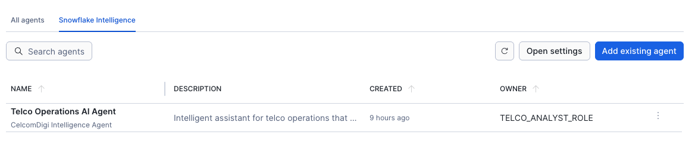

# <h1black>Use Snowflake </h1black><h1blue>Intelligence</h1blue>

Now that you've created your Cortex Agent, let's configure and use **Snowflake Intelligence** to interact with it and ask the questions you configured.

---

## <h1black>⚙️ Step 8: Configure Snowflake </h1black><h1blue>Intelligence (5 minutes)</h1blue>

After creating your agents, you need to configure Snowflake Intelligence to make your agents available and customize how it appears to users.

### <h1sub>Access Intelligence Configuration</h1sub>

**Step 1: Navigate to the Snowflake Intelligence Tab**
1. Go to **AI & ML** in the left navigation
2. Click **Agents**
3. Select the **Snowflake Intelligence** tab at the top


**Step 2: Open Settings**
4. Click the **Open Settings** button in the Snowflake Intelligence tab
5. This opens the Intelligence configuration interface where you can enable agents and customize the appearance



### <h1sub>Configure General Settings</h1sub>

**Step 3: Populate the General Settings**

The screenshot above shows the **General Settings** panel. Configure the following fields as shown:

1. **Display Name**: Enter a user-friendly name for your Intelligence interface (e.g., "Telco Intelligence" or your organization name)
2. **Description**: Add a brief description of what this Intelligence agent can help with
3. **Welcome Message**: Customize the greeting message users see when they start a conversation
4. **Color Theme**: Select colors that match your brand or organizational identity

**Populate the settings as shown in the screenshot above** to ensure a consistent branded experience.

### <h1sub>Customize Intelligence Appearance</h1sub>

**Step 4: Configure Custom Appearance**

Scroll down to the **Custom Appearance** section to brand your Intelligence interface with your organization's logos and colors.

**Brand Your Intelligence Interface:**

**1. Prepare Your Logos:**

Before configuring the appearance, prepare two versions of your organization's logo:

**Compact Logo (for Icon/Small Spaces):**
- Recommended size: 200x200 pixels or similar square format
- Use for the **Icon** field - ideal for small spaces and avatar display
- Should be clear and recognizable at small sizes
- Supported formats: PNG (with transparent background recommended)

**Full-Length Logo (for Header/Banner):**
- Recommended size: 400x100 pixels or similar wide format
- Use for the **Logo** field - ideal for headers and larger display areas
- Should include your full brand name or wordmark
- Supported formats: PNG (with transparent background recommended)

**2. Upload Logos to Snowflake Intelligence:**

In the **Custom Appearance** section, you'll see two upload fields:

**Upload Full Logo (for Header/Banner):**
- Click **Upload** for the **Logo** field
- Select your full-length logo file
- This logo will appear in the Intelligence interface header and banner areas
- The full-length format is ideal for wide display spaces

**Upload Compact Logo (for Icon):**
- Click **Upload** for the **Icon** field
- Select your compact logo file
- This logo will appear as the agent avatar in conversations and small UI elements
- The compact format works better in limited space

**3. Configure Color Theme:**
- Set the **Primary Color** to match your organization's primary brand color (e.g., `#0078D7`)
- Set the **Secondary Color** to your secondary or accent color (e.g., `#FFCC00`)
- These colors will be applied to buttons, highlights, and UI elements
- Preview the colors to ensure they match your brand guidelines

**4. Additional Branding:**
- The agent's `display_name` appears in the UI
- Keep it clear and brand-focused (e.g., "Telco Intelligence Agent")
- This helps users understand which system they're interacting with

**Populate these settings** to create a fully branded Intelligence experience for your organization.

### <h1sub>Assign Agents to Intelligence</h1sub>

**Step 5: Make Your Agent Available**
1. Scroll down to the **Available Agents** section
2. Find your **"Telco Intelligence Agent"** (or **"Telco Operations AI Agent"**)
3. Toggle the switch to **Enable** the agent for Snowflake Intelligence
4. The agent will now appear in the agent dropdown for all authorized users

**Step 6: Set Default Agent**
1. Once enabled, you can set it as the **default agent**
2. Users will automatically start conversations with this agent
3. Users can still switch to other enabled agents as needed

### <h1sub>User Access and Permissions</h1sub>

**Step 7: Control Who Can Use Intelligence:**
1. Grant `SNOWFLAKE.INTELLIGENCE.USAGE` privilege to roles
2. Grant `USAGE` on specific agents to control access
3. Example:
```sql
-- Grant Intelligence access to a role
GRANT USAGE ON AGENT SNOWFLAKE_INTELLIGENCE.AGENTS."Telco Operations AI Agent" 
  TO ROLE TELCO_ANALYST_ROLE;

-- Grant access to underlying data sources
GRANT USAGE ON DATABASE TELCO_OPERATIONS_AI TO ROLE TELCO_ANALYST_ROLE;
GRANT USAGE ON WAREHOUSE CITYFIBRE_DEMO_WH TO ROLE TELCO_ANALYST_ROLE;
```

### <h1sub>Configure Agent Defaults</h1sub>

**Optimize the User Experience:**

1. **Default Warehouse**: Set in agent's tool resources for consistent performance
2. **Query Timeout**: Configure in semantic model execution environments (e.g., 30 seconds)
3. **Search Result Limits**: Set `max_results` in search tool resources (e.g., 4 results)
4. **Sample Questions**: Update these regularly based on user feedback and common queries

### <h1sub>Best Practices for Configuration</h1sub>

✅ **Enable only the agents users need** - Too many options can be confusing  
✅ **Use descriptive agent names** - Make it clear what each agent does  
✅ **Set appropriate permissions** - Follow least-privilege principles  
✅ **Brand consistently** - Use your organization's colors, logos, and terminology  
✅ **Test before rollout** - Validate agent responses with different user roles  
✅ **Document for users** - Create a quick reference guide for common questions  

---

## <h1black>🧠 Step 9: Use Snowflake Intelligence </h1black><h1blue>(10 minutes)</h1blue>


### <h1sub>Verify Your Role</h1sub>

**⚠️ Before you begin, ensure you're using ACCOUNTADMIN:**
- Check the role selector in the **top-left corner**
- If it shows PUBLIC or another role, switch to **ACCOUNTADMIN**
- This ensures you have access to all agents and data sources

### <h1sub>Navigate to Snowflake Intelligence</h1sub>

1. Click **AI & ML** in the left navigation
2. Click **Snowflake Intelligence**
3. You'll see a conversational interface with access to your agent
4. Select your **TELCO_INTELLIGENCE_AGENT** from the agent dropdown

### <h1sub>Understanding Snowflake Intelligence</h1sub>

Snowflake Intelligence provides a unified conversational interface that leverages your Cortex Agent to:
- Query structured data using semantic models (Cortex Analyst)
- Search unstructured data using search services (Cortex Search)
- Combine insights from multiple sources automatically
- Maintain conversation context for follow-up questions

### <h1sub>Test Your Agent with Sample Questions</h1sub>

Try these questions to see your agent in action. The agent will automatically route each question to the appropriate tool (semantic model or search service).  Sample questions are ready for you to select.  After you have selected the first question, select **Agent Details** to run through the remaining questions:


**Network Operations Questions:**
- "Which regions have the highest network latency issues?"
- "Show me 5G towers operating above 80% capacity"
- "What is the average packet loss in each region?"
- "Which infrastructure components need capacity upgrades?"

**Customer Experience Questions:**
- "What are the top 3 customer complaints this month?"
- "Find support tickets about billing issues"
- "Which customer segments have the highest churn risk?"
- "Show me customers with CSAT score below 3"

**Search-Based Questions (Unstructured Data):**
- "Find calls mentioning network connectivity problems"
- "Show me transcripts where customers mention competitors"
- "What support tickets are about roaming charges?"
- "Find complaints about 5G coverage"

**Combined Intelligence Questions:**
- "Are network issues correlated with negative customer sentiment?"
- "Show me regions with both high latency and customer complaints"
- "What percentage of calls mention billing problems?"
- "Which network towers have the most related customer complaints?"

### <h1sub>Observe How the Agent Works</h1sub>

As you ask questions, notice:
- **Automatic Tool Selection** - The agent chooses the right semantic model or search service
- **Contextual Results** - Results are formatted and summarized intelligently
- **Follow-up Capability** - You can ask clarifying questions based on previous answers
- **Multi-source Insights** - Complex questions may combine data from multiple sources

### <h1sub>Experiment and Explore</h1sub>

- Ask variations of the sample questions
- Try follow-up questions like "Can you show me more details?" or "What about other regions?"
- Combine topics: "Show me customer feedback about network issues in Kuala Lumpur"
- Test edge cases to understand the agent's capabilities and limitations

### <h1sub>Tips for Best Results</h1sub>

- Ask clear, specific questions
- Use business terminology (the semantic models are designed for this)
- For search queries, use natural language describing what you're looking for
- If results aren't what you expected, rephrase your question

### <h1sub>Example Conversation Flow</h1sub>

Here's an example of how a conversation might flow:

**You:** *"Which customer segments have the highest churn risk?"*  
**Agent:** *Analyzes the `customer_360_view` and returns a breakdown showing Premium and Enterprise segments have the highest at-risk percentages.*

**You:** *"What are the common complaints from Premium customers?"*  
**Agent:** *Searches `CALL_TRANSCRIPT_SEARCH` and identifies network quality and billing as top issues for Premium segment.*

**You:** *"Show me the revenue impact of at-risk Premium customers."*  
**Agent:** *Queries structured data again to calculate total monthly revenue at risk: $2.3M.*

**You:** *"What specific network issues are they mentioning?"*  
**Agent:** *Returns top themes: 5G coverage gaps, slow data speeds, dropped calls in urban areas.*

Notice how the agent maintains context throughout the conversation and automatically switches between semantic models (structured queries) and search services (unstructured data) based on what's needed!

### <h1sub>Key Benefits of Snowflake Intelligence</h1sub>

**Unified Experience:**
- No need to switch between different tools (Cortex Analyst, Cortex Search, etc.)
- One conversational interface for all your data

**Intelligent Routing:**
- Agent automatically determines which data source to query
- Combines results from multiple sources when needed
- No manual tool selection required

**Context Awareness:**
- Remembers previous questions in the conversation
- Allows for natural follow-up questions
- Builds on prior insights

**Business User Friendly:**
- No SQL or technical knowledge required
- Natural language questions work out of the box
- Visual results and summaries make insights accessible

---

## <h1black>🔧 Monitor and Maintain </h1black><h1blue>Intelligence</h1blue>

**Keep Your Intelligence Running Smoothly:**

- **Usage Tracking**: Monitor which questions are most common
- **Performance**: Check query response times and optimize semantic models
- **Feedback Loop**: Gather user feedback to improve agent responses
- **Regular Updates**: Refresh agents when data models or business requirements change

### <h1sub>Troubleshooting Common Issues</h1sub>

**Agent Not Appearing:**
- Check that the agent is enabled in Intelligence settings
- Verify user has `USAGE` privilege on the agent
- Confirm user's role has access to underlying data sources

**Poor Performance:**
- Review warehouse size for semantic model execution
- Check if query timeout needs adjustment
- Optimize semantic models for frequently asked questions

**Unexpected Responses:**
- Validate semantic model definitions
- Check search service indexing is complete
- Review agent instructions and sample questions

---

**Congratulations!** You've successfully configured and explored the full power of Snowflake Intelligence by combining Cortex Agents, semantic models, and search services into a unified conversational AI experience customized for your organization!
